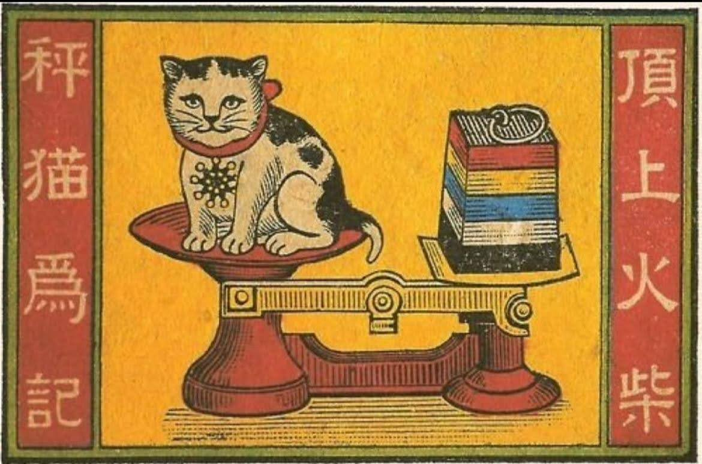

# AI 分析“秤猫为记”火花的含义

这个火柴盒的构图究竟想表达什么？為何搭配鐵血十八星圖與五色旗？

## AI 分析

- [Grok](chengmao-grok.md)
- [DeepSeek](chengmao-deepseek.md)
- [ChatGPT](chengmao-chatgpt.md)
- [Gemini](chengmao-gemini.md)

## 个人分析

- 图中在用秤称猫。 "称猫"有莫谈国事的典故，就是对时局不满但是不愿多说的意思吧。当时是民国初年，政治讽刺画,说政府专制吧.
- 也许是南京和武汉政府争斗期间的漫画。铁血十八星旗是武汉政府的旗帜。南京临时政府用五色旗，之后北京政府沿用。
- 当时的“注册商标”就用“某某为记”来表示，按照如今的说法是”秤猫注册商标“的意思。也可能只是庆祝民国诞生。本来就有“秤猫”这个品牌，虽然也是用典故。这家火柴厂有好几个用猫做标志的商标。还有“猫枪”猫持枪打猎、“猫猴”猴子和猫，之类的。